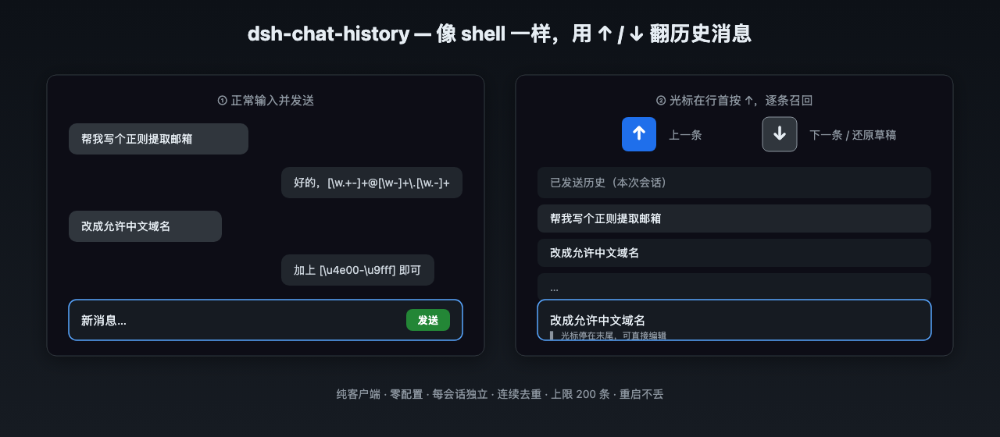

# dsh-chat-history

给 [DeepSeek Harness (DSH)](https://github.com/deepseek-ai/deepseek-harness) 聊天输入框加上 **CLI 风格的历史记忆**：在输入框里按 `↑` 召回上一条发过的内容、按 `↓` 前进或还原草稿，就像在 shell 里翻历史命令一样。


纯客户端插件（无宿主副作用），装上之后**重启不丢**。

## 使用示意



> 插件本身没有可见按钮（组件只挂副作用、返回 `null`），所以这是一张「使用示意」图：左侧正常输入发送，右侧光标停在行首按 `↑` 逐条召回历史、按 `↓` 前进或还原草稿。

## ✨ 特性

- **上下键历史召回** —— `↑` 回到更早的消息，`↓` 回到更新的消息，翻到最新再按 `↓` 还原你正在编辑的草稿
- **启动即预填** —— 打开会话时自动把当前会话里**你之前发过的消息**载入历史，马上就能翻
- **新消息自动记入** —— 发送后自动追加到历史，连续重复去重、上限 200 条
- **不打扰输入** —— 光标不在行首时不抢 `↑/↓`（不影响编辑中文本）；输入法合成、斜杠命令菜单里也不触发
- **纯内存** —— 不写磁盘、每会话独立，重启宿主后从会话历史重新预填

## 📦 安装

```sh
dsh plugin --profile web add github:VioletScar-Hui/dsh-chat-history
```

装完刷新页面即可（浏览器刷新生效，无需重启宿主）。发布到插件市场后，也可直接在侧边栏「插件市场」里搜索安装。

## 🚀 使用

1. 打开任意会话，点击聊天输入框。
2. 光标在**行首**时按 `↑`：召回你上一条发过的消息；继续按 `↑` 往前翻。
3. 按 `↓`：往后翻；翻到最新时再按 `↓`，还原成你本来在编辑的草稿。
4. 直接改文字即可退出浏览状态，正常发送。

## 🔧 实现

- 注册 `conversation.input.left`（list 槽，工具行内，additive），组件返回 `null` 只挂副作用，绝不做 DOM hack。
- 键盘监听在 `document` **捕获阶段**，只认 `textarea[data-phase]`（composer 文本域唯一稳定属性）。
- 历史来源：`ConversationSnapshot.nodes` 里 `kind === 'user'` 节点；发送检测靠 `InputState.phase` 的 `submitting → plain` 迁移。
- 纯逻辑（trim、连续去重、上限 200、提取用户文本）抽在 [`src/client/history.js`](src/client/history.js)，附单测。

更详细的架构说明见 [`docs/architecture.md`](docs/architecture.md)。

## ❓ FAQ

**为什么看不到任何按钮？**
历史召回是纯键盘交互，输入框左侧不新增 UI 元素——这正是「不打扰输入」的设计：功能就在 `↑/↓` 上，没有可见入口。

**历史存在哪里？会不会跨会话串？**
历史只保存在浏览器内存里，每个会话独立 seed。切换会话会重新从当前会话的历史消息预填，不会串。

**重启宿主的会丢吗？**
不会。宿主重启后浏览器重新加载插件，会再次从当前会话已发送的消息里预填历史。唯一「丢」的是你尚未发送的草稿，那本就不属于历史。

**为什么按 `↑` 没反应？**
只有光标在**行首**（`selectionStart === 0`）时才触发；输入法合成中、斜杠命令菜单打开时也不会触发。先点一下输入框开头再按 `↑`。

## 🤝 Contributing

```sh
bun install        # 仅需 bun 作为构建/测试工具，无运行时依赖
bun test           # 单测
bun scripts/build.js  # 重新生成 lib/
```

改动 `src/` 后记得跑一次构建，`lib/` 是提交的预构建产物（安装端免 bun、免构建）。

## 📄 License

[MIT](./LICENSE)
